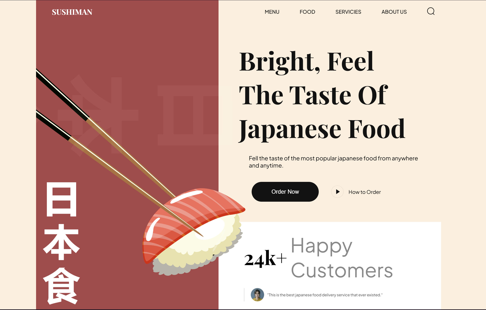

# Sushi Website

A modern, visually appealing sushi website built with HTML and CSS. This site showcases popular sushi dishes, trending items, and Japanese drinks, all with smooth, subtle animations for an engaging user experience.



## Features

- **Popular Food:** Highlighted section for the most popular sushi dishes.
- **Trending Sushi:** Discover trending sushi items with beautiful visuals.
- **Drinks:** Explore a curated list of Japanese drinks.
- **Smooth Animations:** Subtle CSS animations for a modern, interactive feel.
- **Responsive Design:** Looks great on desktop and mobile devices.

## Project Structure

```
assets/         # Images and icons
css/            # CSS files (main and sections)
js/             # JavaScript (animations, interactivity)
index.html      # Main HTML file
public/         # Public assets
```

## Getting Started

1. **Clone the repository:**
   ```sh
   git clone https://github.com/danssou/sushi
   ```
2. **Open `index.html` in your browser.**

No build step is required. All assets and styles are included.

## Customization
- Replace images in the `assets/` folder to update visuals.
- Edit CSS in `css/` for style changes.
- Update content in `index.html` as needed.

## Credits
- Sushi and drink images: Custom or royalty-free sources.
- Icons: SVGs in the `assets/` folder.

---

Enjoy your sushi experience! 🍣
